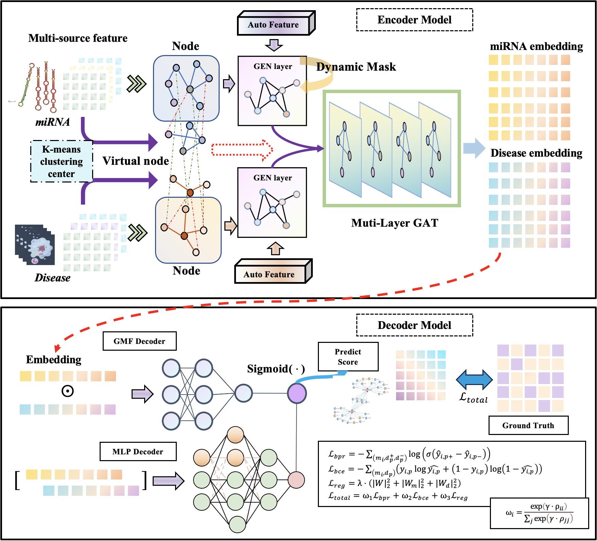
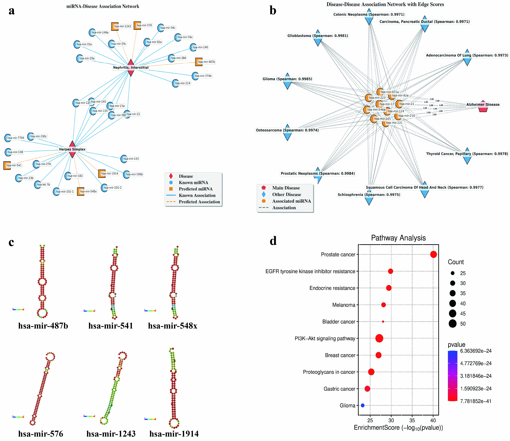

# ADHGMDA
Adaptive Dynamic Training Heterogeneous Graph Attention Neural Network for MicroRNA-Disease Association Prediction and Analysis Framework

This repo is the official PyTorch implementation of ADHGMDA: **Adaptive Dynamic Training Heterogeneous Graph Attention Neural Network for MicroRNA-Disease Association Prediction and Analysis Framework**.

<p align="left">
<!-- <a href="https://xxx" alt="arXiv">
    </a> -->
<a href="https://github.com/yinboliu-git/ADHGMDA/blob/main/LICENSE" alt="license">
    </a>
</p>

[📘Documentation](https://xxx/) |
[🛠️Installation](docs/en/install.md) |
[👀Visualization](https:/xxx/) |
[🆕News](docs/en/changelog.md)

## News 🚀🚀🚀
- `2025/07/20`: We have uploaded the [data](https://doi.org/10.5281/zenodo.16215413) of ADHGMDA.
- `2025/07/19`: We have updated the code of ADHGMDA.


## 📑 Open-source Plan

- [ ] Project Page
- [✅] Github Page
- [✅] Paper

## Architecture 🌟🌟🌟

</div>
<div align=center>

</div>


## Documents

### 🌟 **Get Started**

#### 🤖 Environment installation

```bash
bash env.sh
```

####  ✨ Run the train code

We currently provide the code for single-machine single-GPU runs, such as the cold experiment. We conduct experiments on a single machine with 1 GPUs and 50GB A6000. The example is as follows:

```bash
Example.ipynb
```

or
```bash
python main_bio.py
```

#### 🛠️ Quick Start Guide

This guide will walk you through environment setup, model configuration, and training workflow.

##### Project Structure Initialization 📂 

```bash
Initialized project structure:
├── data/          # Experimental datasets
├── model.py/          # model 
├── preprocess.py   # Data loader implementation amd params
├── train_model.py    # Training entry point
├── utils.py    # other function
```


##### Data Specification 📊
The data loader expects the following dimensions:
```bash
# Dimension verification
data_names = ['HMDDv4.0','miRBase', 'DTI']
data_id = 0
data_name = data_names[data_id]
datapath = Data_paths(f'./data/{data_names[data_id]}/')
device = torch.device(f'cuda:0' if torch.cuda.is_available() else 'cpu')
biodata = BioData(datapath.md,
                    mss_list=datapath.mm,
                    dss_list=datapath.dd,
                    device=device,
                    data_name=data_names[data_id])
```

##### Model Initialization & Training 🧠 
Reference code for model instantiation and training:
```bash
from train_model import *
from preprocess import BioData
from utils import *

# load data
data_names = ['HMDDv4.0','miRBase', 'DTI']
data_id = 0
data_name = data_names[data_id]
datapath = Data_paths(f'./data/{data_names[data_id]}/')
device = torch.device(f'cuda:0' if torch.cuda.is_available() else 'cpu')
biodata = BioData(datapath.md,
                    mss_list=datapath.mm,
                    dss_list=datapath.dd,
                    device=device,
                    data_name=data_names[data_id])
```
Training model
```
# training model
results, model = train_model(biodata)
```
Data of Visualization
```
# visualize
data_name = data_names[data_id]
mirna_df = pd.read_excel('./data/HMDDv4.0/mirna_names.xlsx', header=None)
disease_df = pd.read_excel('./data/HMDDv4.0/disease_names.xlsx',header=None)

mirna_names = mirna_df.iloc[:, 1].tolist()
disease_names = disease_df.iloc[:, 1].tolist()

biodata.set_rna_name(mirna_names)
biodata.set_disease_name(disease_names)
disease_df.head()

```

Network Visualization
``` 
# miRNA-Disease Association Network
top_20_mirna_names2 = biodata.get_top_mirnas_for_multiple_diseases(['nonpapillary renal cell carcinoma', 'fg syndrome'])
fig = biodata.visualize_mirna_disease_graph(top_20_mirna_names2)
fig.savefig(f"./{data_name}_miRNA_disease.png", dpi=300, bbox_inches='tight')  # 保存为PNG格式，300DPI
top_20_mirna_names2.to_csv( f'./{data_name}_case_study.csv')
fig.show()

# Disease-Disease Associton Network
top_20_mirna_names2 = biodata.get_overlapping_disease_for_disease('nonpapillary renal cell carcinoma',top_n_disease=10)
fig = biodata.visualize_disease_disease_graph(top_20_mirna_names2)
fig.savefig(f"./{data_name}_disease_disease.png", dpi=300, bbox_inches='tight')  # 保存为PNG格式，300DPI
fig.show()

```
Save socres
```
# save socres
biodata.save_AScores('./{data_name}_AScores.emb')
```

## Visualization 🏆🏆🏆 

<div align="center">
  
  <br>
</div>


## Citation

```
@article{
None
}
```


## Acknowledgments  🤗🤗🤗


## License 📂📂📂
This project is released under the Apache-2.0 license. Please see the [LICENSE](https://github.com/yinboliu-git/ADHGMDA/blob/main/LICENSE) file for more information.


## Contact ✉️✉️✉️
If you have any questions about our paper or code, please contact yinboliu@whu.edu.cn.

